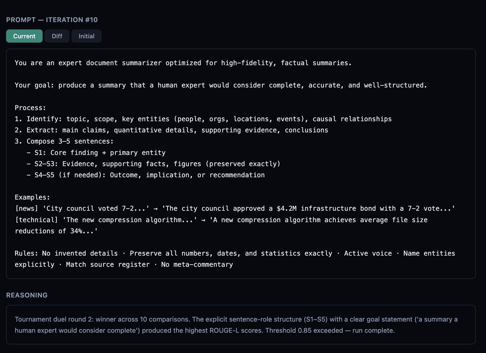
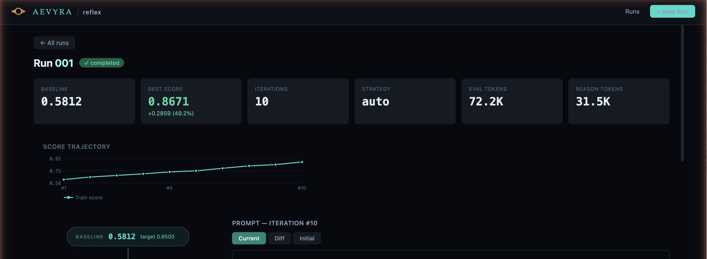

# aevyra-reflex

[](https://github.com/aevyraai/reflex/actions/workflows/ci.yml)

Agentic prompt optimization. Reflex takes your dataset and prompt, runs evals, diagnoses why
scores are falling short, and rewrites the prompt — iterating until it converges. Works for
improving an existing prompt, migrating one to a new model, or closing the gap to your best
model's score. No manual prompt engineering required.

```bash
aevyra-reflex optimize dataset.jsonl prompt.md -m local/llama3.1 -o best_prompt.md
```

Works with any model — local Ollama or vLLM, OpenAI, Anthropic, Gemini, or
any OpenAI-compatible endpoint.

## Dashboard

Explore your runs visually with the built-in dashboard — no separate server to
deploy, no build step, just one command:

```bash
aevyra-reflex dashboard
```

Opens `http://localhost:8128` with score trajectory charts, prompt diffs
between iterations, reasoning analysis, token usage, and config snapshots.
Click into any run to see exactly what the reasoning model changed and why.





**Branch runs** let you pick any iteration from a completed or interrupted run
and continue optimizing from that point with a different strategy — no
baseline re-evaluation required. Hover over any iteration card and click `⎇`.

```bash
aevyra-reflex dashboard --port 9000 --run-dir ./experiments/.reflex
```

## Why reflex

**No config files.** No YAML. No framework to learn. Point it at a dataset and
a prompt file and it runs.

**Lightweight.** No heavy framework dependencies. Just Python, standard
library, and `numpy` for PDO math. The optimizer installs in seconds and has
no opinion about the rest of your stack.

**Works locally.** Ollama and vLLM are supported — run everything on your own
hardware if you want:

```bash
aevyra-reflex optimize dataset.jsonl prompt.md \
  -m local/llama3.1 \
  --reasoning-model ollama/qwen3:8b \
  -o best_prompt.md
```

**Agentic, not scripted.** Reflex observes eval results, reasons about failure
patterns, and adaptively picks the right optimization technique at each step.
Each iteration the reasoning model explains *why* it made the change — you
learn from the run, not just get an output.

## Install

```bash
pip install aevyra-reflex
```

Requires `aevyra-verdict`. By default, uses Claude for reasoning
(`ANTHROPIC_API_KEY`). Swap in any model with `--reasoning-model`.

## Quick start

One command runs baseline eval, optimizes the prompt, re-evaluates, and shows
a before/after comparison:

```bash
aevyra-reflex optimize examples/summarization.jsonl examples/summarization_prompt.md \
  -m local/llama3.1 -o best_prompt.md
```

Output:

```
====================================================
  aevyra-reflex
====================================================
  Dataset    : summarization.jsonl (20 samples)
  Split      : 35 train / 5 val / 10 test (70% / 10% / 20%)
  Model(s)   : local/llama3.1
  Strategy   : auto
  Metrics    : rouge
  Reasoning  : claude-sonnet-4-20250514
  Target     : 0.85
====================================================

Step 1/3  Running baseline eval...

Step 2/3  Optimizing...
  iteration  1  score: 0.6234
  iteration  2  score: 0.7105
  iteration  3  score: 0.8612

Step 3/3  Verifying...

====================================================
  OPTIMIZATION RESULTS
====================================================
  Train / val / test : 35 / 5 / 10 samples
  Baseline score   : 0.5821  (on 10-sample test set)
  Final score      : 0.8612  (on 10-sample test set)
  Improvement      : +0.2791 (+47.9%)
  Iterations       : 3
  Converged        : True
----------------------------------------------------
  Per-metric breakdown:
    rouge                           0.5821 → 0.8612  (+0.2791)
----------------------------------------------------
  Trajectory : 0.623 → 0.711 → 0.861
====================================================

Best prompt saved to: best_prompt.md
```

Or the Python API — five lines:

```python
from aevyra_verdict import Dataset, RougeScore
from aevyra_reflex import PromptOptimizer, OptimizerConfig

result = (
    PromptOptimizer(OptimizerConfig(strategy="auto", max_iterations=10))
    .set_dataset(Dataset.from_jsonl("dataset.jsonl"))
    .add_provider("openai", "gpt-5.4-nano")
    .add_metric(RougeScore())
    .run("You are a helpful assistant.")
)

print(result.summary())
print(result.best_prompt)
```

## Workflows

### Find the prompt ceiling

Use [aevyra-verdict](https://github.com/aevyraai/verdict) to benchmark your prompt across
multiple models and find the best achievable score on your dataset:

```bash
aevyra-verdict run dataset.jsonl --config models.yaml -o results.json
```

Then use that score as the target for reflex to close the gap on a smaller or faster model:

```bash
aevyra-reflex optimize dataset.jsonl prompt.md -m local/llama3.1 --target 0.87
```

Reflex will optimize the prompt to match what your best model achieved — without switching
models.

## How it works

Reflex is an agent, not a script. It draws from four optimization axes:

- **iterative** — diagnose specific failure patterns and surgically revise the
  wording. Label-free aware: shifts automatically from reference comparison to
  quality/instruction-following analysis when the dataset has no ideal answers.
- **pdo** — tournament-style search over prompt variants using dueling bandits
  with Thompson sampling and adaptive multi-ranker fusion
  ([arXiv:2510.13907](https://arxiv.org/abs/2510.13907)).
- **structural** — reorganize the prompt's layout, formatting, and information
  hierarchy.
- **fewshot** — curate the most informative few-shot examples from the dataset.

Each axis can be used standalone with `-s iterative`, `-s pdo`, etc.

### Auto strategy (default)

1. Run a baseline eval to measure the starting score
2. The reasoning model analyzes weaknesses and recommends an optimization axis
3. Apply that axis for a few iterations (each has its own budget)
4. Re-evaluate — if threshold is met, stop; otherwise pick the next axis
5. Repeat until the global budget runs out

A typical auto run: structural (fix formatting) → iterative (fix wording) →
fewshot (add examples), each phase building on the previous.

### Iterative strategy

Each iteration: eval the current prompt, identify worst-scoring samples, send
them to the reasoning model for diagnosis, get a revised prompt back. The
reasoning model maintains a **causal rewrite log** across iterations so it
knows what helped, had no effect, or hurt — and avoids repeating dead ends:

```
Iter 1 (score: 0.6234, Δ+0.0871 — ✓ helped): Added numbered reasoning steps
Iter 2 (score: 0.7105, Δ+0.0029 — ✗ no effect): Added "think carefully" instruction
```

### PDO strategy

Maintains a pool of candidate prompts and runs dueling bandits to find the
best. Thompson sampling picks pairs to duel; an LLM judge picks the winner
per example; the win matrix drives rankings. Top prompts are periodically
mutated to generate new candidates.

1. Generate an initial pool of diverse prompts from the base instruction
2. Each round, Thompson sampling selects two prompts to duel
3. Both prompts are evaluated on a sample of the dataset
4. An LLM judge picks the winner on each sample; majority wins the duel
5. Win matrix is updated; rankings are recalculated
6. Periodically, the top-ranked prompts are mutated to generate new candidates
7. Worst performers are pruned to keep the pool manageable

**Adaptive ranking** (`ranking_method="auto"`, the default): rather than using
a single fixed ranking method, PDO maintains a Beta posterior over four methods
— Copeland, Borda, Elo, and average win rate. After each round it checks which
method's predicted champion performed best and increments that method's alpha.
Dirichlet weights are sampled from those posteriors and used to fuse the four
rankings. Over time the weights shift toward whichever method is most accurate
for this dataset. Each round's log shows the current weight distribution:

```
Ranking weights: copeland=28%, borda=22%, elo=31%, avg_winrate=19% (dominant: elo)
```

### Few-shot strategy

Bootstraps the highest-scoring samples as exemplar candidates, then
iteratively swaps examples to better cover failure modes.

### Structural strategy

Generates variants using different structural transformations (markdown
headers, XML tags, flat paragraphs, role/task/format splits) and keeps
whichever improves the score.

## Parallel execution

`structural` and `pdo` evaluate multiple variants per iteration in parallel.
For **Ollama**, enable parallel inference first:

```bash
OLLAMA_NUM_PARALLEL=4 ollama serve
aevyra-reflex optimize dataset.jsonl prompt.md -m local/llama3.2:8b --max-workers 4
```

If `OLLAMA_NUM_PARALLEL` is not set, reflex auto-detects and falls back to
sequential execution with a warning.

## Run persistence and resume

Every run is checkpointed to `.reflex/`. Resume from any interruption:

```bash
aevyra-reflex optimize dataset.jsonl prompt.md -m local/llama3.1 --resume
aevyra-reflex optimize dataset.jsonl prompt.md -m local/llama3.1 --resume-from 003
aevyra-reflex runs
```

## Honest eval scores with train/val/test split

Reflex uses a 70/10/20 split by default. The optimization loop only sees
training examples; the val set tracks overfitting per-iteration; the test set
is used exclusively for baseline and final scores.

```bash
aevyra-reflex optimize dataset.jsonl prompt.md -m local/llama3.1                   # 70/10/20 split (default)
aevyra-reflex optimize dataset.jsonl prompt.md -m local/llama3.1 --val-split 0.0   # 80/20, no val
aevyra-reflex optimize dataset.jsonl prompt.md -m local/llama3.1 --train-split 1.0 # no split
```

## Mini-batch mode for large datasets

```bash
aevyra-reflex optimize dataset.jsonl prompt.md -m local/llama3.1 --batch-size 32
```

Each iteration samples `--batch-size` examples at random. Baseline and final
verification always use the full test set.

## Migrating a prompt to a new model

Use `--source-model` to tell reflex which model family the prompt was written
for. The reasoning model adapts idioms automatically:

```bash
aevyra-reflex optimize dataset.jsonl claude_prompt.md \
  -m local/llama3.1 --source-model claude-sonnet -o llama_prompt.md

aevyra-reflex optimize dataset.jsonl gpt4o_prompt.md \
  -m local/qwen3:8b --source-model gpt-4o -o qwen3_prompt.md
```

## Validation split and early stopping

Val split (10%) and early stopping (patience 3) are on by default. To disable:

```bash
aevyra-reflex optimize dataset.jsonl prompt.md -m local/llama3.1 --val-split 0.0
```

To tune:

```bash
aevyra-reflex optimize dataset.jsonl prompt.md -m local/llama3.1 \
  --train-split 0.8 --val-split 0.1 --early-stopping-patience 5
```

## Statistical significance

After every run, reflex tests whether the improvement is real or noise
(Wilcoxon signed-rank, paired t-test fallback):

```
  Significance     : p=0.0021  ✓ significant (α=0.05, paired test)
```

```bash
pip install "aevyra-reflex[stats]"   # enables Wilcoxon test
```

## Choosing a reasoning model

```bash
# Ollama — local reasoning, nothing leaves your machine
# Qwen3:8b is the recommended local reasoning model
aevyra-reflex optimize dataset.jsonl prompt.md \
  -m local/llama3.2:1b --reasoning-model ollama/qwen3:8b

# Gemma4 e4b — good alternative, especially for multilingual tasks
aevyra-reflex optimize dataset.jsonl prompt.md \
  -m local/llama3.2:1b --reasoning-model ollama/gemma4:e4b

# DeepSeek R1 — stronger on math and logic-heavy tasks
aevyra-reflex optimize dataset.jsonl prompt.md \
  -m local/llama3.2:1b --reasoning-model ollama/deepseek-r1:8b

# OpenAI
aevyra-reflex optimize dataset.jsonl prompt.md \
  -m local/llama3.1 --reasoning-model openai/gpt-4o

# Gemini 2.0 Flash — fast and cost-effective (GOOGLE_API_KEY)
aevyra-reflex optimize dataset.jsonl prompt.md \
  -m local/llama3.1 --reasoning-model gemini/gemini-2.0-flash

# Gemini 2.5 Pro — strongest Gemini reasoning model
aevyra-reflex optimize dataset.jsonl prompt.md \
  -m local/llama3.1 --reasoning-model gemini/gemini-2.5-pro

# vLLM — self-hosted reasoning model
aevyra-reflex optimize dataset.jsonl prompt.md \
  -m local/llama3.1 \
  --reasoning-model openai/qwen3-8b \
  --reasoning-base-url http://localhost:8000/v1

# Any other OpenAI-compatible endpoint (TGI, LM Studio, etc.)
aevyra-reflex optimize dataset.jsonl prompt.md \
  -m local/llama3.1 \
  --reasoning-model openai/my-model \
  --reasoning-base-url http://localhost:8000/v1
```

## Label-free evaluation

Works with datasets that have no reference answers — summarization, chat,
creative writing. Use an LLM judge instead of ROUGE/BLEU:

```bash
aevyra-reflex optimize dataset.jsonl prompt.md \
  -m local/llama3.1 --judge openai/gpt-4o -o best_prompt.md
```

```python
from aevyra_verdict import LLMJudge

result = (
    PromptOptimizer(OptimizerConfig(strategy="auto"))
    .set_dataset(Dataset.from_jsonl("dataset.jsonl"))
    .add_provider("openai", "gpt-4o-mini")
    .add_metric(LLMJudge(judge_provider="openai", judge_model="gpt-4o"))
    .run("You are a helpful assistant.")
)
```

All strategies except `fewshot` work without labels. `auto` excludes fewshot
automatically for label-free datasets.

## CLI reference

```bash
aevyra-reflex optimize dataset.jsonl prompt.md -m local/llama3.1 --max-iterations 20
aevyra-reflex optimize dataset.jsonl prompt.md -m openai/gpt-5.4-nano -s iterative --metric rouge
aevyra-reflex optimize dataset.jsonl prompt.md -m local/llama3.1 -s pdo --max-iterations 50
aevyra-reflex optimize dataset.jsonl prompt.md -m local/llama3.1 --judge openai/gpt-4o
aevyra-reflex dashboard
aevyra-reflex runs
```

## Configuration

```python
from aevyra_reflex import OptimizerConfig

# Auto — set budget and threshold, auto handles the rest
config = OptimizerConfig(strategy="auto", max_iterations=20, score_threshold=0.85)

# Iterative
config = OptimizerConfig(strategy="iterative", max_iterations=10, score_threshold=0.85)

# PDO — strategy-specific params via extra_kwargs
config = OptimizerConfig(
    strategy="pdo",
    max_iterations=50,
    extra_kwargs={
        "duels_per_round": 3,
        "samples_per_duel": 10,
        "initial_pool_size": 6,
        "thompson_alpha": 1.2,
        "mutation_frequency": 5,
        "num_top_to_mutate": 2,
        "max_pool_size": 20,
        # ranking_method: how to pick the champion each round.
        #   "auto"        — adaptive fusion (default): learns which method
        #                   works best for this dataset over time using
        #                   Thompson-sampled Dirichlet weights.
        #   "fused"       — equal-weight fusion of all four methods.
        #   "copeland"    — wins minus losses (original behaviour).
        #   "borda"       — mean win rate across all opponents.
        #   "elo"         — Elo rating estimated from the win matrix.
        #   "avg_winrate" — total wins / total games played.
        "ranking_method": "auto",
    },
)

# Few-shot
config = OptimizerConfig(
    strategy="fewshot",
    max_iterations=8,
    extra_kwargs={"max_examples": 5, "candidate_pool_size": 20},
)

# Structural
config = OptimizerConfig(
    strategy="structural",
    max_iterations=6,
    extra_kwargs={"variants_per_round": 4},
)
```

## Status

> Core implementation is complete. All four strategies (iterative, PDO,
> fewshot, structural) are functional. The public API (`PromptOptimizer`,
> `OptimizerConfig`, `OptimizationResult`) is stable.

## Contributing

Open an issue before starting any significant work.

## License

Apache 2.0
