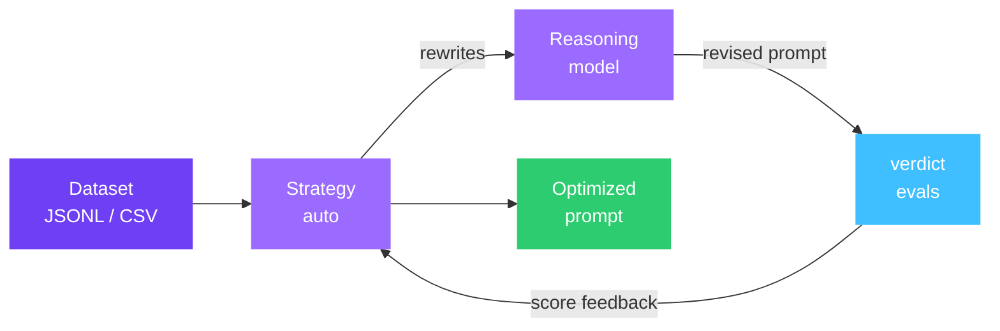
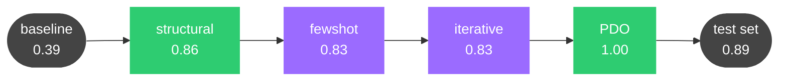

# aevyra-reflex

[](https://github.com/aevyraai/reflex/actions/workflows/ci.yml)
[](https://pypi.org/project/aevyra-reflex/)
[](LICENSE)
[](https://aevyra.mintlify.app/reflex/introduction)

Agentic prompt optimization built for production workloads. Reflex takes your dataset and
prompt, runs evals, diagnoses why scores are falling short, and rewrites the prompt — iterating
until it converges. Runs can be interrupted and resumed at any point without losing work, and
every token spent is tracked across sessions so you always know the cost. Every rewrite is
accompanied by a reasoned explanation of what changed and why — prompt diffs, score
attributions, and the full reasoning trace are persisted as a durable audit trail. Works for
improving an existing prompt, migrating one to a new model, or closing the gap to your best
model's score.

```bash
aevyra-reflex optimize dataset.jsonl prompt.md -m local/llama3.1:8b -o best_prompt.md
```

Works with any model — local Ollama or vLLM, OpenAI, Anthropic, Gemini, or
any OpenAI-compatible endpoint.

## Dashboard

Explore your runs visually with the built-in dashboard — no separate server to
deploy, no build step, just one command:

```bash
aevyra-reflex dashboard
```

Opens `http://localhost:8128` with score trajectory charts, prompt diffs
between iterations, reasoning analysis, token usage, and config snapshots.
Click into any run to see exactly what the reasoning model changed and why.


**Branch runs** let you pick any iteration from a completed or interrupted run
and continue optimizing from that point with a different strategy — no
baseline re-evaluation required. Hover over any iteration card and click `⎇`.

```bash
aevyra-reflex dashboard --port 9000 --run-dir ./experiments/.reflex
```

## Why reflex

**No config files.** No YAML. No framework to learn. Point it at a dataset and
a prompt file and it runs.

**Lightweight.** No heavy framework dependencies. Just Python, standard
library, and `numpy` for PDO math. The optimizer installs in seconds and has
no opinion about the rest of your stack.

**Works locally.** Ollama and vLLM are supported — run everything on your own
hardware if you want:

```bash
aevyra-reflex optimize dataset.jsonl prompt.md \
  -m local/llama3.1:8b\
  --reasoning-model ollama/qwen3:8b \
  -o best_prompt.md
```

**Agentic, not scripted.** Reflex observes eval results, reasons about failure
patterns, and adaptively picks the right optimization technique at each step.
Each iteration the reasoning model explains *why* it made the change — you
learn from the run, not just get an output.

**Crash-safe resumption.** Every iteration is checkpointed to disk as it completes.
Kill the process, restart the machine, lose your connection — `--resume` picks up
exactly where it left off. Val history, best-prompt selection, and token totals are
all restored correctly across as many interruptions as you need.

**Full token accounting.** Eval tokens and reasoning tokens are tracked per iteration
and accumulated across sessions, including resumed runs. The final results show the
true total cost of the optimization, not just the last session. Per-iteration
breakdown is visible live in the CLI and in the dashboard.

**Overfitting protection.** An optional validation split monitors generalization
throughout training. The best prompt is selected against the val set, not the
training score — so the final test eval reflects real-world performance rather than
a prompt tuned to the specific examples it was optimized on.

## Install

```bash
pip install aevyra-reflex
```

Requires `aevyra-verdict`. Use `--reasoning-model` to pick any model for the
reasoning step — OpenRouter, Ollama, OpenAI, Anthropic, or any
OpenAI-compatible endpoint.

## Quick start

One command runs baseline eval, optimizes the prompt, re-evaluates, and shows
a before/after comparison. This example teaches a model to produce strict
3-sentence executive briefs from security incident reports — starting from a
vague prompt that scores 0.38 and finishing at 0.89 on a held-out test set.

The example below uses OpenRouter (pay-per-token, no local setup needed), but
any supported provider works — swap `-m` and `--judge` for Anthropic, OpenAI,
a local Ollama or vLLM instance, or any OpenAI-compatible endpoint:

```bash
export OPENROUTER_API_KEY=sk-or-...

aevyra-reflex optimize examples/security_incidents.jsonl \
  examples/security_incidents_prompt.md \
  -m openrouter/meta-llama/llama-3.1-8b-instruct \
  --reasoning-model openrouter/qwen/qwen3-8b \
  --judge openrouter/qwen/qwen3-8b \
  --judge-criteria examples/security_incidents_judge.md \
  --max-workers 4 \
  -o examples/security_incidents_best_prompt.md
```

Output:

```
====================================================
  aevyra-reflex
====================================================
  Dataset    : security_incidents.jsonl (100 samples)
  Split      : 45 train / 20 val / 35 test (45% / 20% / 35%)
  Model(s)   : openrouter/meta-llama/llama-3.1-8b-instruct
  Strategy   : auto
  Metrics    : LLM judge
  Reasoning  : openrouter/qwen/qwen3-8b
  Target     : 0.8500
  Workers    : 4
====================================================

Step 1/3  Running baseline eval...
[run 069][auto] Baseline TEST SET score: 0.3786

Step 2/3  Optimizing...
  Phase 1 (structural) done: score=0.8611, converged=True
  Phase 2 (fewshot)    done: score=0.8278, converged=False
  Phase 3 (iterative)  done: score=0.8333, converged=False
  Phase 4 (pdo)        done: score=1.0000, converged=True

Step 3/3  Verifying...

====================================================
  OPTIMIZATION RESULTS
====================================================
  Train/val/test   : 45 / 20 / 35 samples
  Baseline score   : 0.3786  (on 35-sample test set)
  Final score      : 0.8857  (on 35-sample test set)
  Improvement      : +0.5071 (+134.0%)
  Significance     : p=0.0000  ✓ significant (α=0.05, paired test)
  Iterations       : 10
  Converged        : True
----------------------------------------------------
  Per-metric breakdown:
    llm_judge                       0.3786 → 0.8857  (+0.5071)
----------------------------------------------------
  Train traj : 0.389 → 0.739 → 0.828 → 0.822 → 0.806 → 0.833 → 0.828 → 0.672 → 1.000 → 1.000
  Val traj   : 0.438 → 0.762 → 0.775 → 0.800 → 0.750 → 0.838 → 0.800 → 0.650 → 0.900 → 0.838
====================================================

Best prompt saved to: examples/security_incidents_best_prompt.md
```

The starting prompt is four words: `Summarize this security incident report.`
The model produces markdown bullets at 0.38. After 10 iterations across 4
strategy phases, the same model produces tight 3-sentence briefs at 0.89 —
statistically significant on 35 held-out examples it never saw.

See the [full walkthrough](docs/tutorial-security-incidents.mdx) for a
phase-by-phase breakdown of what changed and why.

Or the Python API:

```python
from aevyra_verdict import Dataset, LLMJudge
from aevyra_verdict.providers import OpenRouterProvider
from aevyra_reflex import PromptOptimizer
from pathlib import Path

result = (
    PromptOptimizer()
    .set_dataset(Dataset.from_jsonl("examples/security_incidents.jsonl"))
    .add_provider("openrouter", "meta-llama/llama-3.1-8b-instruct")
    .add_metric(LLMJudge(
        judge_provider=OpenRouterProvider(model="qwen/qwen3-8b"),
        criteria=Path("examples/security_incidents_judge.md").read_text(),
    ))
    .run(Path("examples/security_incidents_prompt.md").read_text())
)

print(result.summary())
print(result.best_prompt)
```

## Workflows

### Find the prompt ceiling

Use [aevyra-verdict](https://github.com/aevyraai/verdict) to benchmark your prompt across
multiple models and find the best achievable score on your dataset:

```bash
aevyra-verdict run dataset.jsonl --config models.yaml -o results.json
```

Then use that score as the target for reflex to close the gap on a smaller or faster model:

```bash
aevyra-reflex optimize dataset.jsonl prompt.md -m local/llama3.1:8b --target 0.87
```

Reflex will optimize the prompt to match what your best model achieved — without switching
models.

## How it works



Reflex is an agent, not a script. It draws from four optimization axes:

- **iterative** — diagnose specific failure patterns and surgically revise the
  wording. Label-free aware: shifts automatically from reference comparison to
  quality/instruction-following analysis when the dataset has no ideal answers.
- **pdo** — tournament-style search over prompt variants using dueling bandits
  with Thompson sampling and adaptive multi-ranker fusion
  ([arXiv:2510.13907](https://arxiv.org/abs/2510.13907)).
- **structural** — reorganize the prompt's layout, formatting, and information
  hierarchy.
- **fewshot** — curate the most informative few-shot examples from the dataset.

Each axis can be used standalone with `-s iterative`, `-s pdo`, etc.

### Auto strategy (default)

1. Run a baseline eval to measure the starting score
2. The reasoning model analyzes weaknesses and recommends an optimization axis
3. Apply that axis for a few iterations (each has its own budget)
4. Re-evaluate — if threshold is met, stop; otherwise pick the next axis
5. Repeat until the global budget runs out



Each phase hands its best prompt to the next. Green = phases where the score
jumped; purple = phases that contributed but didn't break out. Scores are from
the [security incidents tutorial](docs/tutorial-security-incidents.mdx).

### Iterative strategy

Each iteration: eval the current prompt, identify worst-scoring samples, send
them to the reasoning model for diagnosis, get a revised prompt back. The
reasoning model maintains a **causal rewrite log** across iterations so it
knows what helped, had no effect, or hurt — and avoids repeating dead ends:

```
Iter 1 (score: 0.6234, Δ+0.0871 — ✓ helped): Added numbered reasoning steps
Iter 2 (score: 0.7105, Δ+0.0029 — ✗ no effect): Added "think carefully" instruction
```

### PDO strategy

Maintains a pool of candidate prompts and runs dueling bandits to find the
best. Thompson sampling picks pairs to duel; an LLM judge picks the winner
per example; the win matrix drives rankings. Top prompts are periodically
mutated to generate new candidates.

1. Generate an initial pool of diverse prompts from the base instruction
2. Each round, Thompson sampling selects two prompts to duel
3. Both prompts are evaluated on a sample of the dataset
4. An LLM judge picks the winner on each sample; majority wins the duel
5. Win matrix is updated; rankings are recalculated
6. Periodically, the top-ranked prompts are mutated to generate new candidates
7. Worst performers are pruned to keep the pool manageable

**Adaptive ranking** (`ranking_method="auto"`, the default): rather than using
a single fixed ranking method, PDO maintains a Beta posterior over four methods
— Copeland, Borda, Elo, and average win rate. After each round it checks which
method's predicted champion performed best and increments that method's alpha.
Dirichlet weights are sampled from those posteriors and used to fuse the four
rankings. Over time the weights shift toward whichever method is most accurate
for this dataset. Each round's log shows the current weight distribution:

```
Ranking weights: copeland=28%, borda=22%, elo=31%, avg_winrate=19% (dominant: elo)
```

### Few-shot strategy

Bootstraps the highest-scoring samples as exemplar candidates, then
iteratively swaps examples to better cover failure modes.

### Structural strategy

Generates variants using different structural transformations (markdown
headers, XML tags, flat paragraphs, role/task/format splits) and keeps
whichever improves the score.

## Parallel execution

`structural` and `pdo` evaluate multiple variants per iteration in parallel.
For **Ollama**, enable parallel inference first:

```bash
OLLAMA_NUM_PARALLEL=4 ollama serve &
OLLAMA_NUM_PARALLEL=4 aevyra-reflex optimize dataset.jsonl prompt.md -m local/llama3.1:8b --max-workers 4
```

If `OLLAMA_NUM_PARALLEL` is not set, reflex auto-detects and falls back to
sequential execution with a warning.

## Dataset formats

Reflex accepts JSONL and CSV files. JSONL auto-detects OpenAI, ShareGPT, and Alpaca
schemas. For non-standard field names or CSV files, use `--input-field` and `--output-field`:

```bash
# CSV with default column names (input, ideal)
aevyra-reflex optimize data.csv prompt.md -m local/llama3.1:8b

# CSV with custom column names
aevyra-reflex optimize data.csv prompt.md -m local/llama3.1:8b \
  --input-field article --output-field summary

# JSONL with non-standard field names
aevyra-reflex optimize data.jsonl prompt.md -m local/llama3.1:8b \
  --input-field question --output-field answer

# Label-free (no reference answers — use --judge instead of --metric)
aevyra-reflex optimize data.jsonl prompt.md -m local/llama3.1:8b \
  --input-field prompt --judge openai/gpt-4o
```

## Run persistence and resume

Every run is checkpointed to `.reflex/`. Resume from any interruption:

```bash
aevyra-reflex optimize dataset.jsonl prompt.md -m local/llama3.1:8b --resume
aevyra-reflex optimize dataset.jsonl prompt.md -m local/llama3.1:8b --resume-from 003
aevyra-reflex runs
```

## Honest eval scores with train/val/test split

Reflex uses a 70/10/20 split by default. The optimization loop only sees
training examples; the val set tracks overfitting per-iteration; the test set
is used exclusively for baseline and final scores.

```bash
aevyra-reflex optimize dataset.jsonl prompt.md -m local/llama3.1:8b                  # 70/10/20 split (default)
aevyra-reflex optimize dataset.jsonl prompt.md -m local/llama3.1:8b --val-split 0.0   # 80/20, no val
aevyra-reflex optimize dataset.jsonl prompt.md -m local/llama3.1:8b --train-split 1.0 # no split
```

## Mini-batch mode for large datasets

```bash
aevyra-reflex optimize dataset.jsonl prompt.md -m local/llama3.1:8b --batch-size 32
```

Each iteration samples `--batch-size` examples at random. Baseline and final
verification always use the full test set.

## Migrating a prompt to a new model

Use `--source-model` to tell reflex which model family the prompt was written
for. The reasoning model adapts idioms automatically:

```bash
aevyra-reflex optimize dataset.jsonl claude_prompt.md \
  -m local/llama3.1:8b --source-model claude-sonnet -o llama_prompt.md

aevyra-reflex optimize dataset.jsonl gpt4o_prompt.md \
  -m local/qwen3:8b --source-model gpt-4o -o qwen3_prompt.md
```

## Validation split and early stopping

Val split (10%) and early stopping (patience 3) are on by default. To disable:

```bash
aevyra-reflex optimize dataset.jsonl prompt.md -m local/llama3.1:8b --val-split 0.0
```

To tune:

```bash
aevyra-reflex optimize dataset.jsonl prompt.md -m local/llama3.1:8b\
  --train-split 0.8 --val-split 0.1 --early-stopping-patience 5
```

## Statistical significance

After every run, reflex tests whether the improvement is real or noise
(Wilcoxon signed-rank, paired t-test fallback):

```
  Significance     : p=0.0021  ✓ significant (α=0.05, paired test)
```

```bash
pip install "aevyra-reflex[stats]"   # enables Wilcoxon test
```

## Choosing a reasoning model

Reflex automatically detects the dominant language of your dataset (Chinese,
Japanese, Korean, Arabic, Russian, etc.) and instructs the reasoning model to
write all revised prompts and explanations in that language. No configuration
required — it works out of the box with any reasoning model.

```bash
# Ollama — local reasoning, nothing leaves your machine
# Qwen3:8b is the recommended local reasoning model
aevyra-reflex optimize dataset.jsonl prompt.md \
  -m local/llama3.2:1b --reasoning-model ollama/qwen3:8b

# Gemma4 e4b — good alternative, especially for multilingual tasks
aevyra-reflex optimize dataset.jsonl prompt.md \
  -m local/llama3.2:1b --reasoning-model ollama/gemma4:e4b

# DeepSeek R1 — stronger on math and logic-heavy tasks
aevyra-reflex optimize dataset.jsonl prompt.md \
  -m local/llama3.2:1b --reasoning-model ollama/deepseek-r1:8b

# OpenAI
aevyra-reflex optimize dataset.jsonl prompt.md \
  -m local/llama3.1:8b --reasoning-model openai/gpt-4o

# Gemini 2.0 Flash — fast and cost-effective (GOOGLE_API_KEY)
aevyra-reflex optimize dataset.jsonl prompt.md \
  -m local/llama3.1:8b --reasoning-model gemini/gemini-2.0-flash

# Gemini 2.5 Pro — strongest Gemini reasoning model
aevyra-reflex optimize dataset.jsonl prompt.md \
  -m local/llama3.1:8b --reasoning-model gemini/gemini-2.5-pro

# vLLM — self-hosted reasoning model
aevyra-reflex optimize dataset.jsonl prompt.md \
  -m local/llama3.1:8b\
  --reasoning-model openai/qwen3-8b \
  --reasoning-base-url http://localhost:8000/v1

# Any other OpenAI-compatible endpoint (TGI, LM Studio, etc.)
aevyra-reflex optimize dataset.jsonl prompt.md \
  -m local/llama3.1:8b\
  --reasoning-model openai/my-model \
  --reasoning-base-url http://localhost:8000/v1
```

## Label-free evaluation

Works with datasets that have no reference answers — summarization, chat,
creative writing. Use an LLM judge instead of ROUGE/BLEU:

```bash
aevyra-reflex optimize dataset.jsonl prompt.md \
  -m local/llama3.1:8b --judge openai/gpt-4o -o best_prompt.md
```

Pass a custom criteria file to tell the judge exactly what to look for:

```bash
aevyra-reflex optimize dataset.jsonl prompt.md \
  -m anthropic/claude-haiku-4-5-20251001 \
  --judge anthropic/claude-sonnet-4-6 \
  --judge-criteria criteria.md
```

The criteria file is plain text describing your evaluation rubric and scoring
scale (1–5). Without `--judge-criteria` the judge uses a default
accuracy/helpfulness/clarity/completeness rubric.

```python
from aevyra_verdict import LLMJudge
from aevyra_verdict.providers import OpenRouterProvider

result = (
    PromptOptimizer()
    .set_dataset(Dataset.from_jsonl("dataset.jsonl"))
    .add_provider("openrouter", "meta-llama/llama-3.1-8b-instruct")
    .add_metric(LLMJudge(
        judge_provider=OpenRouterProvider(model="qwen/qwen3-8b"),
        criteria=Path("criteria.md").read_text(),
    ))
    .run("You are a helpful assistant.")
)
```

All strategies except `fewshot` work without labels. `auto` excludes fewshot
automatically for label-free datasets.

## Pipeline mode

Sometimes the prompt you want to optimize lives inside a multi-step agent pipeline — classify → retrieve → generate — rather than controlling a single LLM call. Traditional eval re-runs the same static traces each iteration; changes to the prompt don't affect what got classified or retrieved. Pipeline mode fixes this by re-running the full pipeline on every optimization iteration with the current candidate prompt, so each stage executes fresh.

```python
from aevyra_reflex import PromptOptimizer, AgentTrace, TraceNode
from aevyra_verdict import LLMJudge
from aevyra_verdict.providers import OpenRouterProvider

def run_pipeline(prompt: str, ticket: str) -> AgentTrace:
    ticket_type = classify_ticket(ticket)            # your existing code
    policy      = retrieve_policy(ticket_type)
    response    = generate_response(ticket, policy, prompt)  # prompt controls this node

    return AgentTrace(
        nodes=[
            TraceNode("classify",  ticket,      ticket_type),
            TraceNode("retrieve",  ticket_type, policy),
            TraceNode("generate",  ticket,      response, optimize=True),
        ],
        ideal=expected_response,   # optional — shown in failure reports
    )

result = (
    PromptOptimizer()
    .set_pipeline(run_pipeline)
    .set_inputs(tickets)          # list of raw inputs
    .add_metric(LLMJudge(
        judge_provider=OpenRouterProvider(model="qwen/qwen3-8b"),
        criteria="Score the full pipeline trace: classification accuracy, policy retrieval quality, and response quality.",
    ))
    .run("You are a customer service agent. Answer clearly and empathetically.")
)
```

The CLI equivalent:

```bash
aevyra-reflex optimize prompt.md \
  --pipeline-file pipeline.py \
  --inputs-file tickets.json \
  --judge openrouter/qwen/qwen3-8b \
  --judge-criteria criteria.md
```

`pipeline.py` must define a `pipeline_fn(prompt, input) -> AgentTrace` function. `tickets.json` is a JSON array of inputs.

The judge evaluates the full trace text — all nodes, their inputs and outputs — so it can assess the pipeline end-to-end. Mark the node being optimized with `optimize=True` to highlight it in the trace output. No `add_provider()` call is needed; the pipeline handles its own model calls.

Pipeline mode works with all strategies including `pdo`. In PDO pipeline mode, duel pairs are evaluated by running the full pipeline with each candidate prompt and comparing scores directly — no LLM judge needed for the duel itself. Pipeline mode is mutually exclusive with `set_dataset()`; use one or the other.

## CLI reference

```bash
aevyra-reflex optimize dataset.jsonl prompt.md -m local/llama3.1:8b --max-iterations 20
aevyra-reflex optimize dataset.jsonl prompt.md -m openai/gpt-5.4-nano -s iterative --metric rouge
aevyra-reflex optimize dataset.jsonl prompt.md -m local/llama3.1:8b -s pdo --max-iterations 50
aevyra-reflex optimize dataset.jsonl prompt.md -m local/llama3.1:8b --judge openai/gpt-4o
aevyra-reflex optimize dataset.jsonl prompt.md -m anthropic/claude-haiku-4-5-20251001 --judge anthropic/claude-sonnet-4-6 --judge-criteria rubric.md
aevyra-reflex dashboard
aevyra-reflex runs
```

## Configuration

```python
from aevyra_reflex import OptimizerConfig

# Auto — set budget and threshold, auto handles the rest
config = OptimizerConfig(strategy="auto", max_iterations=20, score_threshold=0.85)

# Iterative
config = OptimizerConfig(strategy="iterative", max_iterations=10, score_threshold=0.85)

# PDO — strategy-specific params via extra_kwargs
config = OptimizerConfig(
    strategy="pdo",
    max_iterations=50,
    extra_kwargs={
        "duels_per_round": 3,
        "samples_per_duel": 10,
        "initial_pool_size": 6,
        "thompson_alpha": 1.2,
        "mutation_frequency": 5,
        "num_top_to_mutate": 2,
        "max_pool_size": 20,
        # ranking_method: how to pick the champion each round.
        #   "auto"        — adaptive fusion (default): learns which method
        #                   works best for this dataset over time using
        #                   Thompson-sampled Dirichlet weights.
        #   "fused"       — equal-weight fusion of all four methods.
        #   "copeland"    — wins minus losses (original behaviour).
        #   "borda"       — mean win rate across all opponents.
        #   "elo"         — Elo rating estimated from the win matrix.
        #   "avg_winrate" — total wins / total games played.
        "ranking_method": "auto",
    },
)

# Few-shot
config = OptimizerConfig(
    strategy="fewshot",
    max_iterations=8,
    extra_kwargs={"max_examples": 5, "candidate_pool_size": 20},
)

# Structural
config = OptimizerConfig(
    strategy="structural",
    max_iterations=6,
    extra_kwargs={"variants_per_round": 4},
)
```

## Integrations

Reflex has built-in callbacks for MLflow and Weights & Biases.

### MLflow

```bash
pip install aevyra-reflex[mlflow]
mlflow ui  # start the tracking server

aevyra-reflex optimize dataset.jsonl prompt.md \
  --reasoning-model openrouter/qwen/qwen3-8b \
  --mlflow \
  --mlflow-experiment my-project
```

Each run logs params, a `score_train` / `score_val` / `score_test` trajectory, an interactive `iterations.json` table (prompt + reasoning per iteration), and the best prompt as an artifact.

### Weights & Biases

```bash
pip install aevyra-reflex[wandb]

aevyra-reflex optimize dataset.jsonl prompt.md \
  --reasoning-model openrouter/qwen/qwen3-8b \
  --wandb \
  --wandb-project my-project
```

Logs the same metrics to W&B Charts, with `score_train`, `score_val`, and `score_test` (baseline + final) as separate series and summary fields in the run Overview.

See [docs/integrations.mdx](docs/integrations.mdx) for the Python API and custom callback interface.

---

## Status

> Core implementation is complete. All four strategies (iterative, PDO,
> fewshot, structural) are functional. The public API (`PromptOptimizer`,
> `OptimizerConfig`, `OptimizationResult`) is stable.

## Contributing

Open an issue before starting any significant work.

## License

Apache 2.0
